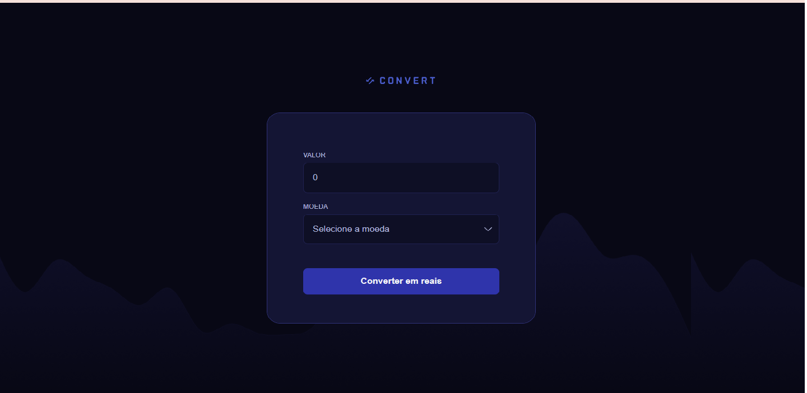

## 
 CONVERSOR DE MOEDAS (CONVERT)     

### 
 Este conversor foi feito junto as aulas de Javascript da Rocketseat. 

---

[Projeto](###-projeto)  |  [Aprendizados](###-aprendizados)  |  [Tecnologias](###-tecnologias)

### 🚀 PROJETO
O Convert é um conversor de moeda online que visa converter os seguintes valores em Real:
* USD - Dolar;
* EUR - Euro;
* GBP - Libra;
Este projeto foi feito junto da aula Convert do módulo de Javascript da trilha Fullstack da Rocketseat.

---

### 📚 APRENDIZADOS

[x] Foi trabalhado recursos de DOM;  
[x] Foi utilizado variáveis e constantes;  
[x] Foi utilizado funções para conversão da moeda;  

---

### 👩‍💻 TECNOLOGIAS
* Javascript